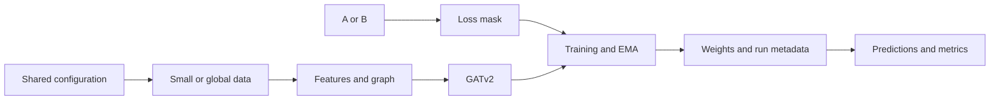

# Code guide / 代码导览

There is one model and one training loop for both A and B. The graph option changes
the supplied feature table; the variant changes only the loss mask.

A/B 共用模型和训练循环；图选项决定输入节点，A/B 选项只决定监督标签集合。

| File | Responsibility / 职责 |
|---|---|
| `src/constants.py` | Fixed 17-feature order / 固定特征顺序 |
| `src/features.py` | Physical feature formulas / 物理特征公式 |
| `src/data.py` | Prepared data, graph edges, masks, standardization / 数据、连边、掩码与标准化 |
| `src/model.py` | Stem → two GATv2 layers → residual head / 网络结构 |
| `src/training.py` | Shared optimizer, noise, EMA and training loop / 统一训练实现 |
| `src/workflow.py` | Configuration, validation, training/prediction commands / 配置与运行流程 |
| `scripts/reproduce.py` | Replay supplied 200-seed ensembles / 复算已有权重的集成结果 |
| `scripts/train.py` | Thin training entry point / 训练入口 |
| `scripts/predict.py` | Thin inference entry point / 预测入口 |

To change the architecture, edit `model.py`. To change a common hyperparameter,
edit `configs/aligned.json`. To change graph rules or split policy, edit `data.py`
and keep the corresponding integrity tests. `workflow.py` checks duplicate nodes,
split overlap, finite inputs, and target consistency before training.

修改网络看 `model.py`；修改统一参数看 `configs/aligned.json`；修改图或划分规则看
`data.py`。预测入口会读取新训练的元数据，防止意外使用不同图、模型或标准化参数。

`configs/aligned.json` sets the training parameters. `configs/pretrained.json`
contains the settings used by the pretrained ensembles.

`configs/aligned.json` 定义训练参数，`configs/pretrained.json` 保存预训练集成模型的配置。
